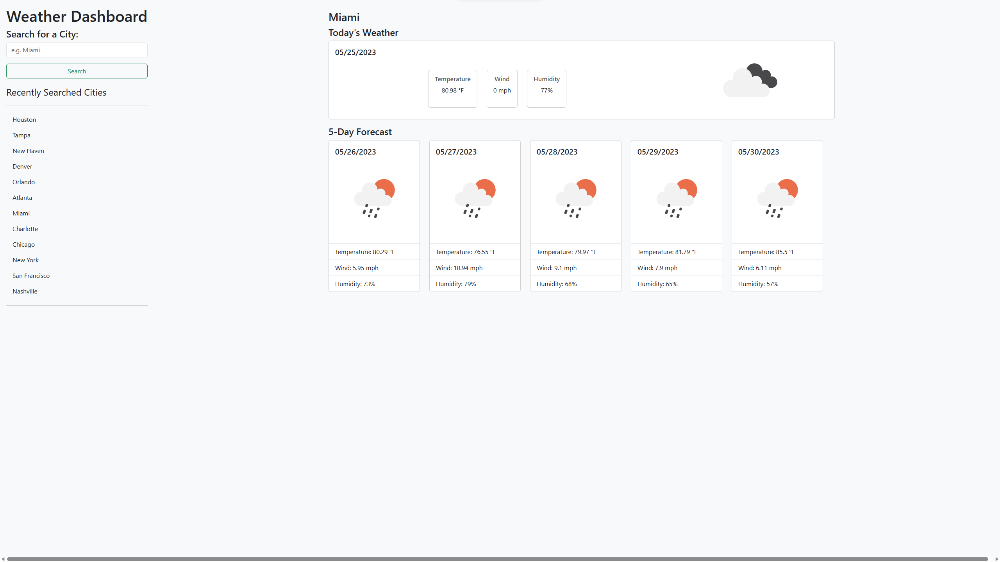

# Weather Dashboard

## Description
This application retrieves weather data for cities through form inputs and calls to the OpenWeather API. The user is able to submit the name of a city and retrieve the current weather conditions of the city as well as a five day forecast. As the user looks up the weather of different cities, their searches are saved for reference.

## Screenshots
### Weather Dashboard Home Page

## Credits
The Bootstrap CSS framework was used for the design and implementation of the frontend of this application. jQuery predominantly used for the backend.

## Deploy
